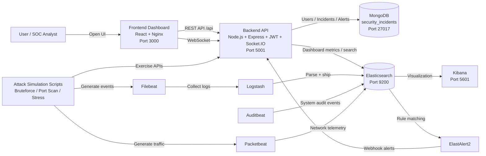
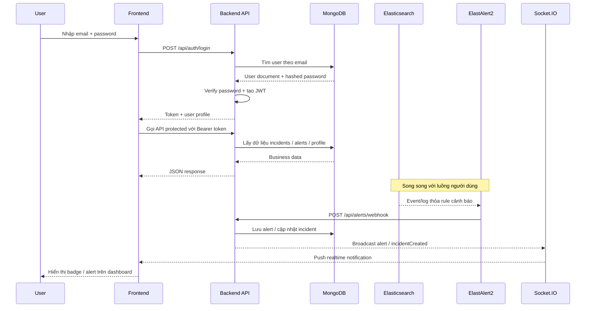

# Security Incident Response Dashboard

Nền tảng giám sát – phát hiện – cảnh báo – phản ứng sự cố bảo mật thời gian gần thực dựa trên ELK Stack (Elasticsearch, Logstash, Kibana) và Dashboard UI (React/Node/MongoDB).

## 🚀 Quick Start

### Yêu cầu hệ thống
- Ubuntu 20.04+ hoặc Docker-compatible OS
- Docker 24+, Docker Compose v2
- RAM tối thiểu: 4GB (khuyến nghị 8GB)
- Dung lượng trống: 5GB+

### Cài đặt và chạy

```bash
# 1. Clone repository
git clone <repository-url>
cd security-elk

# 2. Khởi chạy tất cả services
docker-compose up --build -d

# 3. Chờ services khởi động (1-2 phút)
# Kiểm tra trạng thái
docker-compose ps

# 4. Truy cập ứng dụng
# Frontend: http://localhost:3000
# Kibana: http://localhost:5601
# Elasticsearch: http://localhost:9200
# Backend API: http://localhost:5001
```

### Thông tin đăng nhập mặc định
- **Email:** `admin@security.local`
- **Password:** `admin123`

## 🔧 Troubleshooting

### Lỗi 502 Bad Gateway
Nếu gặp lỗi 502 khi đăng nhập, thực hiện các bước sau:

```bash
# 1. Kiểm tra backend container
docker ps | grep backend

# 2. Nếu backend không chạy, rebuild và start lại
docker-compose build backend
docker-compose up -d backend

# 3. Kiểm tra logs backend
docker-compose logs backend

# 4. Reset admin password nếu cần
docker exec backend node scripts/reset-admin-password.js
```

### Lỗi Permission Denied
Nếu backend không thể tạo logs directory:

```bash
# Rebuild backend với quyền phù hợp
docker-compose build --no-cache backend
docker-compose up -d backend
```

### Các lỗi thường gặp khác

**Elasticsearch không khởi động:**
```bash
# Tăng memory limit
sudo sysctl -w vm.max_map_count=262144
docker-compose restart elasticsearch
```

**MongoDB connection failed:**
```bash
# Kiểm tra MongoDB container
docker-compose logs mongodb
# Restart nếu cần
docker-compose restart mongodb backend
```

**Frontend không load:**
```bash
# Rebuild frontend
docker-compose build frontend
docker-compose up -d frontend
```

## 📊 Cổng dịch vụ

| Service | Port | Description |
|---------|------|-------------|
| Frontend Dashboard | 3000 | React UI |
| Backend API | 5001 | Node.js API |
| Elasticsearch | 9200 | Search engine |
| Kibana | 5601 | Visualization |
| Logstash | 5044, 5000, 9600 | Log processing |
| MongoDB | 27017 | Database |

## 🗺️ Sơ đồ kiến trúc

### 1. Tổng quan hệ thống



### 2. Luồng đăng nhập và cảnh báo realtime



### Ghi chú nhanh
- `mongodb:27017` là hostname nội bộ giữa các container trong Docker network.
- `localhost:27017` là địa chỉ dùng từ máy host hoặc MongoDB Compass.
- Frontend dùng Nginx proxy `/api` sang backend và nhận realtime qua Socket.IO.
- MongoDB lưu dữ liệu nghiệp vụ; Elasticsearch lưu log và telemetry để phân tích/cảnh báo.

## 🎯 Demo và Testing

### Tạo sự cố giả lập

**Port Scan Detection:**
```bash
# Từ máy khác trong mạng
nmap -Pn -sT -p 1-200 -T4 <IP_HOST>
```

**SSH Brute Force:**
```bash
# Chạy script demo
./scripts/simulate_bruteforce.sh
```

**Network Stress:**
```bash
# Chạy script demo
./scripts/simulate_network_stress.sh
```

### Kiểm tra trong Kibana
1. Truy cập http://localhost:5601
2. Vào Discover
3. Chọn index pattern `packetbeat*` hoặc `filebeat*`
4. Filter theo thời gian (Last 15 minutes)
5. Tìm kiếm events liên quan

## 🔔 Cấu hình cảnh báo

### Telegram Bot
Cập nhật trong `docker-compose.yml`:
```yaml
environment:
  - TELEGRAM_BOT_TOKEN=your_bot_token
  - TELEGRAM_CHAT_ID=your_chat_id
```

### ElastAlert Rules
Các rule cảnh báo trong `elk-stack/elastalert/rules/`:
- `port_scan.yaml` - Phát hiện quét cổng
- `ssh_bruteforce.yaml` - Tấn công brute force SSH
- `failed_login.yaml` - Đăng nhập thất bại
- `sudo_escalation.yaml` - Sử dụng sudo bất thường
- `network_stress.yaml` - Tăng đột biến traffic

## 🏗️ Cấu trúc dự án

```
security-elk/
├── backend/                 # Node.js API (Express, JWT, Socket.IO)
│   ├── models/             # MongoDB models
│   ├── routes/             # API routes
│   ├── middleware/         # Authentication, error handling
│   ├── utils/              # Logger, helpers
│   └── scripts/            # Database scripts
├── frontend/               # React Dashboard
│   ├── src/
│   │   ├── components/     # React components
│   │   ├── pages/          # Page components
│   │   ├── contexts/       # React contexts
│   │   └── utils/          # API configuration
├── elk-stack/              # ELK Stack configurations
│   ├── elasticsearch/      # ES configs
│   ├── logstash/           # Logstash pipelines
│   ├── kibana/             # Kibana configs
│   ├── filebeat/           # Filebeat configs
│   ├── auditbeat/          # Auditbeat configs
│   ├── packetbeat/         # Packetbeat configs
│   └── elastalert/         # Alert rules
├── scripts/                # Demo and utility scripts
├── docs/                   # Documentation
└── docker-compose.yml      # Docker orchestration
```

## 🔒 Bảo mật

⚠️ **Lưu ý:** Cấu hình hiện tại dành cho demo/testing:
- CORS cho phép tất cả origins (`*`)
- CSP (Content Security Policy) được tắt
- Rate limiting được giảm nhẹ
- Trust proxy được bật

**Để production:**
1. Cấu hình CORS whitelist cụ thể
2. Bật CSP và các security headers
3. Sử dụng HTTPS/WSS
4. Cấu hình rate limiting nghiêm ngặt
5. Bảo vệ webhook endpoints

## 📝 API Documentation

Truy cập API docs tại: http://localhost:5001/docs

### Endpoints chính:
- `POST /api/auth/login` - Đăng nhập
- `GET /api/dashboard/stats` - Thống kê dashboard
- `GET /api/incidents` - Danh sách sự cố
- `POST /api/alerts/webhook` - Webhook cho ElastAlert

## 🐛 Debug và Logs

```bash
# Xem logs của tất cả services
docker-compose logs

# Xem logs của service cụ thể
docker-compose logs backend
docker-compose logs frontend
docker-compose logs elasticsearch

# Theo dõi logs real-time
docker-compose logs -f backend
```

## 📞 Hỗ trợ

Nếu gặp vấn đề:
1. Kiểm tra logs: `docker-compose logs`
2. Kiểm tra trạng thái containers: `docker-compose ps`
3. Restart services: `docker-compose restart`
4. Tạo issue trong repository

## 📄 License

MIT License - Xem file LICENSE để biết thêm chi tiết.

---

**Tip:** Giữ cùng timezone và thời gian trong tất cả components để đảm bảo logs được hiển thị chính xác.
